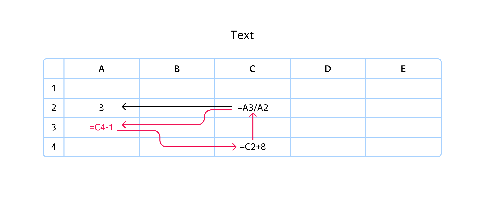

# cpp-spreadsheet
Электронная таблица
# Описание
«Электронная таблица»‎ - упрощённый аналог, например, листа Microsoft Excel.
## Ячейки (Cell)
Поддерживаются следующие виды ячеек:
- Формульная
- Текстовая

Формульная ячейка может содержать ссылки на другие ячейки листа.
При этом выбрасываются исключения, если:
1. задана синтаксически некорректная формула:
```
"=hd+2-+3((//)(112"
```
2. индекс ячейки невалидный:
```
"=ABCDEFGHIJKLMNOPQRS1234567890"
``` 
3. есть циклические ссылки в формульных ячейках


Кроме того, обрабатываются следующие ошибки при вычислении формул:
1. FormulaError::Category::Ref - ссылка на ячейку с некорректной позицией;
2. FormulaError::Category::Arithmetic - ошибка при вычислении арифметических операций, например, деление на 0;
2. FormulaError::Category::Value - если ячейку, чей индекс входит в формулу, нельзя проинтерпретировать как число.
## Лист (Sheet)
Представляет двумерный массив ячеек Cell.
Таблицу можно вывести в стандартный поток ввода-вывода.
При этом выводится минимальное количество строк и столбцов, но вмещающее в себя все непустые ячейки.
# TODO
[ ] Добавление графического интерфейса
# Исользование
```
auto sheet = CreateSheet();
sheet->SetCell("E2"_pos, "A1");
sheet->SetCell("E4"_pos, "=E2");
```
Более подробные примеры использования в тестах в main.cpp.
# Ситстемные требования
1. С++17 и выше
2. GCC (MinGW-64) 11.2.0
# Стек технологий:
1. CMake 3.8
2. [ANTLR 4.13.1](https://www.antlr.org/)